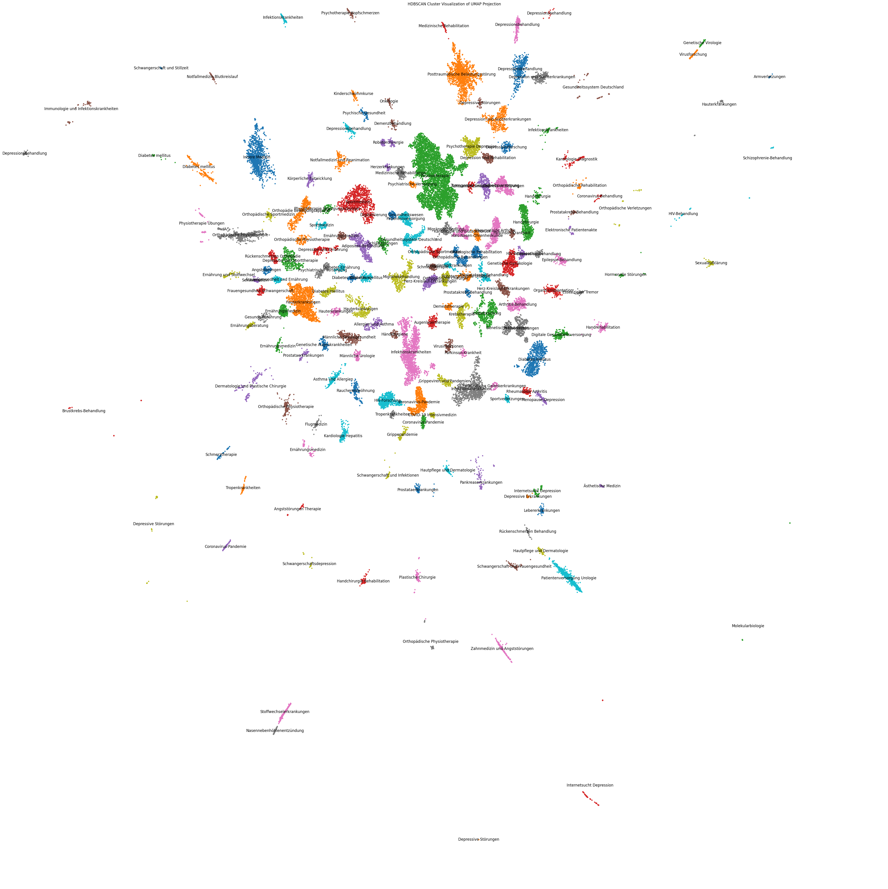
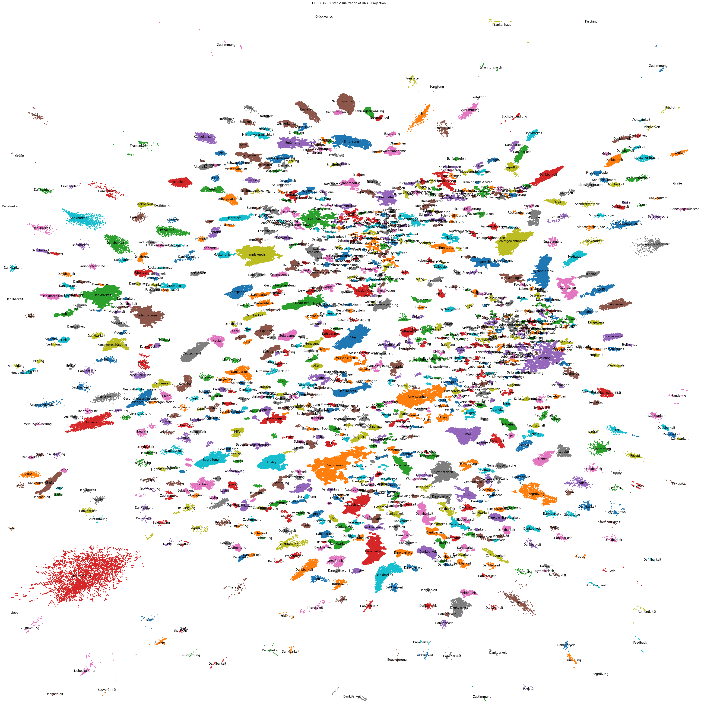
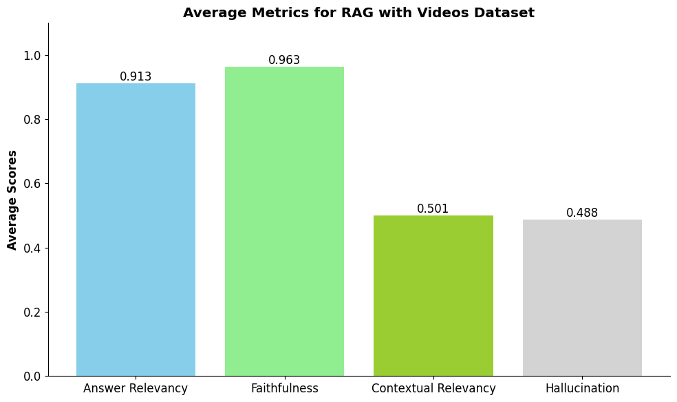
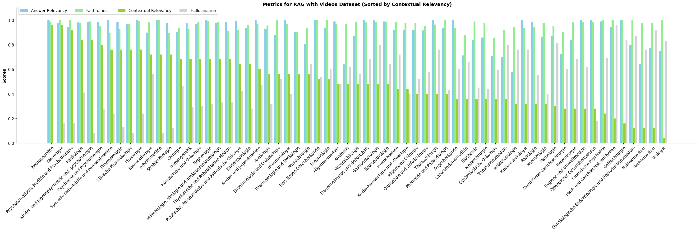
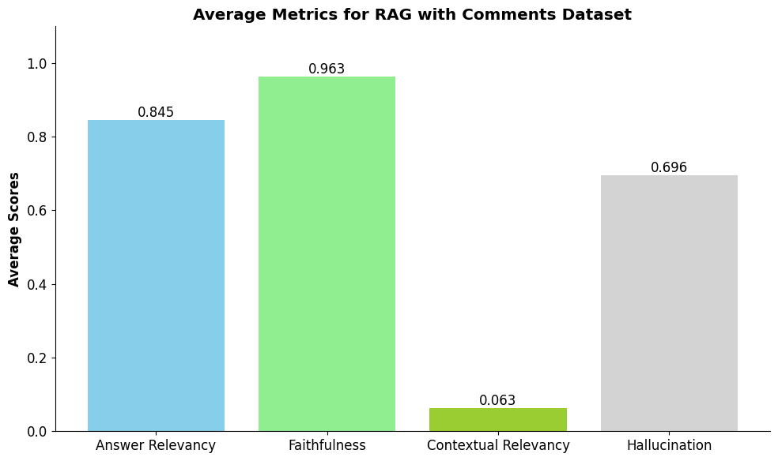
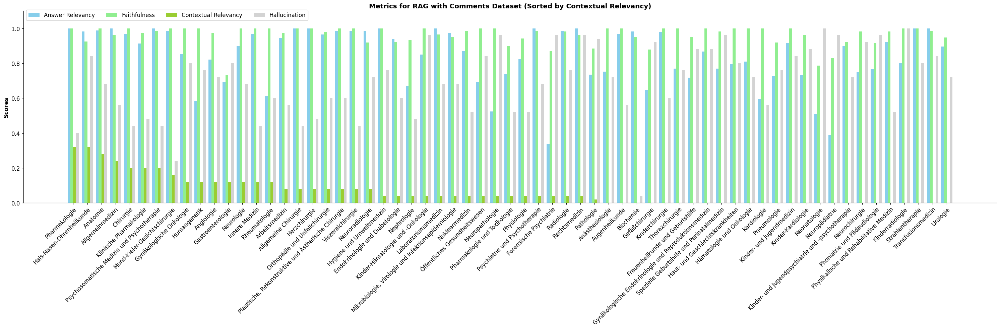
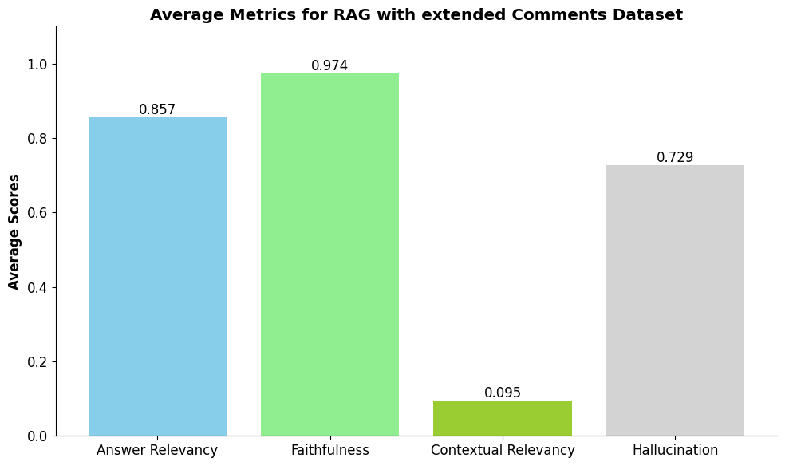
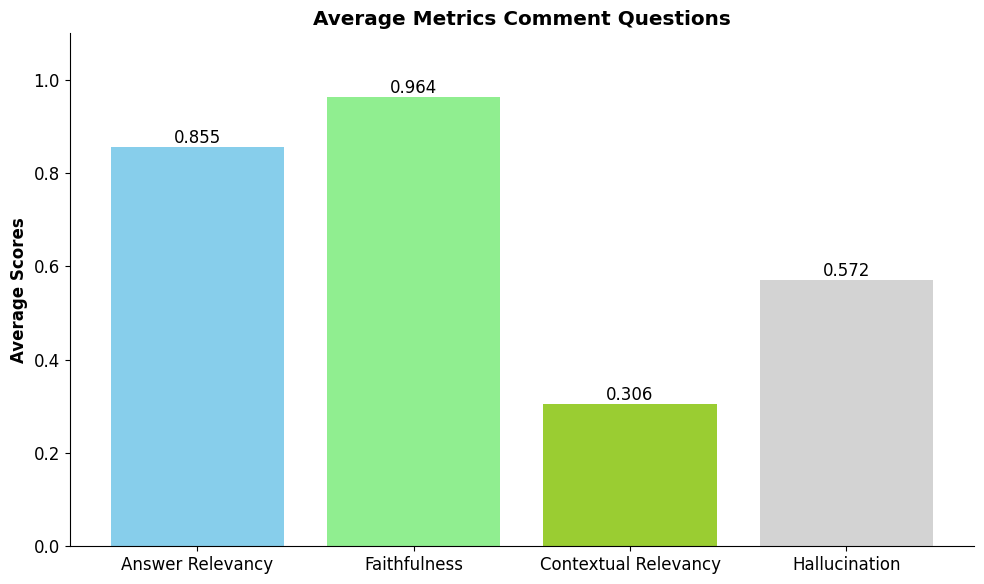

# YouTube Videos of Medfluencer Channels as Source of Medical Information

## From Advanced Webscraping to Downstream Application

This repository was created as part of a 'Data and Coputer Science' practical at Heidelberg University. The goal of the pracical was to evaluate how medical data retrieved from YouTube could be used for machine learning applications, especially for Retrieval Augmented Generation (RAG).

The advantages of RAG systems are that they can generate text based on a given user prompt and verified or trusted information retrieved from a database. This is especially useful for medical applications, as the generated answer is based on trusted information and the source of the information can be cited for the user to verify.

To evaluate wether YouTube could be used as a source of medical information for RAG systems, a dataset of 94.422 video descriptions, titles and transcriptions as well as 998.721 comments from 362 different medical influencers was created. The content of the dataset was evaluated by semantic clustering. A RAG system was implemented to generate answers based on the dataset and the results were evaluated using "DeepEval".

## Table of Contents

1. [Project Structure](#project-structure)
2. [Installation and Usage](#installation-and-usage)
3. [Data Retrieval](#data-retrieval)
4. [Data Analysis](#data-analysis)
5. [RAG System](#rag-system)
6. [RAG Evaluation](#rag-evaluation)
7. [Conclusion](#conclusion)

## Project Structure

```
.
├── 📁 embeddings/    # Contains all embeddings and relevant additional information
│   ├── 📊 comment_embeddings_part_[1-4].npy   # Comment embeddings split into 4 parts
│   ├── 📊 video_description_embeddings.npy    # Embeddings of video descriptions
│   ├── 📊 video_ids.npy                       # Array of (filtered) video IDs
│   ├── 📊 video_title_embeddings.npy          # Embeddings of video titles
│   ├── 📊 video_transcription_chunks_embeddings_part_[1-3].npy  # Chunked transcription embeddings
│   ├── 📄 video_transcription_chunks.json     # Chunked transcriptions
│   └── 📊 video_transcription_embeddings.npy  # Full video transcription embeddings
│
├── 📁 evaluation/    # Contains all evaluation data and metrics
│   ├── 📄 answers_*.json                      # Various RAG answer sets for different scenarios
│   ├── 📄 comment_clustering.json             # Results of comment clustering
│   ├── 📊 comment_embeddings_2d*.npy          # 2D projections of comment embeddings
│   ├── 📦 evaluation_metrics_rag_*.pkl        # Evaluation metrics for RAG system variants
│   ├── 📄 questions_*.json                    # Various question sets for evaluation
│   ├── 📄 video_clustering.json               # Results of video clustering
│   └── 📊 video_description_embeddings_2d.npy # 2D projections of video description embeddings
│
├── 📁 mesh/  # Data from the Medical Subject Headings (MeSH) database
│   ├── 📝 ET.TXT   # Entry terms for MeSH
│   └── 📝 MH.TXT   # Main headings for MeSH
│
├── 📁 scraping/  # Contains all scraped data
│   ├── 📄 channels_scraping.json              # Scraped channel information
│   ├── 📄 comments_scraping_extended.json     # Scraped comments with replies
│   ├── 📄 comments_scraping.json              # Scraped comments without replies
│   ├── 📄 medfluencer_channel_names.json      # List of medfluencer channel names
│   ├── 📄 playlists_scraping.json             # Scraped playlist information
│   └── 📄 videos_scraping.json                # Scraped video information
│
├── 📓 medfluencer_data_analysis.ipynb    # Jupyter notebook for data analysis and clustering
├── 📓 medfluencer_index.ipynb            # Jupyter notebook for embedding and indexing
├── 📓 medfluencer_rag.ipynb              # Jupyter notebook for RAG implementation and evaluation
├── 📓 medfluencer_scrape_channel_names.ipynb  # Jupyter notebook for scraping channel names
├── 📓 medfluencer_scraping.ipynb         # Jupyter notebook for scraping data from YouTube
├── 📄 medical_fields.json                # List and categorization of medical fields
└── 📝 README.md                          # Project documentation and overview
```

## Installation and Usage

This project mainly uses Google Colab for executing juptyer notebooks. Once a notebook is opened on Google Colab, the necessary libraries can be installed with the `%pip install` commands at the beginning of each notebook. It is also recommended to clone this GitHub repository in the Google Colab environment to access the data. The necessary command can be found in ech notebook. A GitHub access token is required.

The scraping of YouTube data was not performed on Google Colab, but on a local machine. The commands for installation of necessary libraries are included at the beginning of the notebook.

## Data Retrieval

This project used a combination of approaches to retrieve relevant medical data from YouTube. This are most importantly:

1. Data Scraping using Selenium
2. Accessing the YouTube Data API

In the end, a dataset of 94.422 video descriptions, titles and transcriptions as well as 998.721 comments from 362 different medical professionals was created.

The implementation can be found in the [scraping notebook](./medfluencer_scraping.ipynb)

### Data Scraping using Selenium

YouTube enables channels to be verified as medical professionals. This verification is indicated by a blue ribbon above the description of each video. However the verification status of a channel is not directly accessible via the YouTube Data API. Therefore this information has to be scraped by inspecting the HTML code of a YouTube video. This was done using the Selenium library in Python.

In order to cover a broad range of medical topics, channel names were scraped by searching for various [medical fields](./medical_fields.json) in the YouTube search bar. The search results were then filtered by channels and the channel names were stored in a [JSON file](./medfluencer_scrape_channel_names.ipynb).

With the channel names available, most data could be accessed using the YouTube Data API, however the transcripts of videos were not available. As this was crucial data for the RAG system it had to be scraped. I decided to implement my own scraping algorithm using Selenium. However, there also exist libraries like `youtube-transcript-api` that can be used.

#### Practical Remarks

- It is important to make sure, that no advertisements are being played during the scraping, as this can lead to transcripts of the ad being scraped instead of the video.
- The text data of the transcripts often contains no punctuation and contains errors in word recognition
- The implementation of the scraping algorithm does not use a database but stores all data in JSON files at [./scraping](./scraping/). This is not recommended for large datasets.

### Accessing the YouTube Data API

For all other relevant data, the YoutTube API can be used. The API provides access to a wide range of data, such as video descriptions, titles, comments, replies, likes, dislikes, etc. The API can be accessed using a Google Cloud Platform account. Request authentication is done using an API key.

#### Practical Remarks

- There is a limit of 10.000 requests per day for the YouTube Data API. This can be a limiting factor when scraping large amounts of data.
- It is advised to look at the cost of each request type, as some requests can be more expensive than others.

## Data Analysis

To analyze the content of the YouTube data, we will first of all take a look at an example of an individual video:

```json
{
  "channel_name": "@MayoClinic",
  "description": "Dr. Burchill dives deeper into the ways his integrated practice meets the needs of patients in a more complete way, from focusing on mental health to understanding cultural background.\n\nFor more information on Dr. Burchill and the Mayo Clinic team’s care for ACHD patients ...",
  "transcription": "If we are genuinely\ncommittedto responding to the\nneeds of our patients,we have to think broadlyabout what those\nneeds are.And I've been\nin this fieldlong enough to know\nthat our patients arenot coming to\nspeak to me justabout their palpitation\nor their chest pain.They're coming with\ncomplicated livesand needs that\nrelate to , yesphysical issues, butalso mental health needs.Also cultural and\nspiritual, and so on ...",
  "title": "Supporting the complete human needs of patients with ACHD, Dr. Luke Burchill, Mayo Clinic"
}
```

For readability reasons, only the first part of the description and transcription are shown. The content is as expected with the description and title giving an overviwe of the video and the transcription being a machine generated text of the spoken content of the video. It is important to note that the transcription is not perfect and contains errors. quite frequently.

Here is an example of a comment:

```json
{
  "text": "only few people can live with enthusiasm like that guy, regardless of their situation.",
  "authorDisplayName": "@mubarakgidadoumar3247",
  "video_id": "ZeV0fL8eKAQ",
  "replies": []
}
```

Again, nothing out of the ordinary. The comment contains the text, the author and the video ID.
It should be noted, that the large comments dataset [./scraping/comments_scraping.json](./scraping/comments_scraping.json) contains comments mostly without replies, while the smaller dataset [./scraping/comments_scraping_extended.json](./scraping/comments_scraping_extended.json) contains comments with replies (when available). The reason lies in the scraping algorithm, which was not able to scrape replies to comments in large quantities due to YouTube rate limits.

To further analyze the content of the data, semantic clustering was used. The goal was to group similar videos or comments together in order to find frequnt topics. The implementation can be found in the [data analysis notebook](./medfluencer_data_analysis.ipynb).

### Semantic Clustering Videos

The semantic clustering for the video dataset was performed as follows:

1. Embed Video Descriptions​
2. Reduce Embedding Dimension to 2 (**UMAP**)​
3. Cluster Points by cosine similarity (**DBSCAN**)​
4. Retrieve Transcriptions of Videos for each Cluster​
5. Remove all words not part of medical keyword dataset (**MESH**)​
6. Sort words by frequency​
7. Ask LLM to infer topic label from top 15 words for each cluster

Here is the result:



On first glance it is impressive, that the clustering resulted in such distinct clusters. However, DBSCAN creates a special class which contains all points that are not part of a cluster. This class is often the largest and contains all outliers. In this visualization, the outlier class is not shown, hence the clusters appear to be very distinct.

The plot shows, that there exists a broad range of medical topics in the dataset, the most frequent ones being:

1. Psychotherapy
2. Orthopaedics
3. Nutrition
4. Skin
5. Infectious Diseases

### Semantic Clustering Comments

The semantic clustering for the comments dataset was performed similar to the video dataset. The only differences are, that the comment text was embedded and used for keyword-extraction and that the keywords were not filtered using the MESH dataset

Here is the result:



Again, the plot shows a broad range of topics. The most frequent ones being:

1. Nutrition / Drug Use
2. Orthopedics
3. COVID
4. Clinic / Operation
5. Deperession / Fear / Neurological Disorders
6. Age / Dementia
7. Parenting

These topics are in one way or another also contained within the video dataset. The following topics are unique to the comments dataset:

1. Opinion
2. Conspiracy
3. Emotion / Spirituality
4. Approval
5. Rejection

## RAG System

One basic requirement for a RAG system to operate is the embedding of the dataset. As the data contains german as well as english videos, the embedding was done using an english-german sentence transformer: [T-Systems-onsite/cross-en-de-roberta-sentence-transformer](https://huggingface.co/T-Systems-onsite/cross-en-de-roberta-sentence-transformer) loaded from huggingface. The implementation can be found in the [index notebook](./medfluencer_index.ipynb) and the resulting embeddings can be found at [./embeddings](./embeddings/). To efficiently use the embeddings in a RAG system, they were also uploaded to a vector store called Pinecone.

To put the embedded and indexed dataset to use, two RAG systems were implemented. One for the videos dataset and one for the comments dataset. The implementation can be found in the [RAG notebook](./medfluencer_rag.ipynb).

The RAG systems were implemented using llamaindex and consist of the following modules:

1. Retriever: A retriever module that retrieves the most relevant documents from the dataset based on the user query. The retriever is configured to use the Pinecone vector store and retrieve the top 20 most similar documents.
2. Reranking: An english-german cross encoder is used to further filter the top 5 most relevant documents.
3. Response Synthesizer: An LLM called Claude 3.5 Sonnet was used for the generation of the final response.

## RAG Evaluation

To evaluate the quality of the RAG system and the underlying dataset, an LLM was used to generate 5 medical questions for each of the [medical fields](./medical_fields.json) which would then be answered by the RAG system.

To evaluate the answers of the RAG system, the DeepEval framework was used. The framework provides a set of evaluation metrics to evaluate the quality of the generated answers. The evaluation metrics are:

1. Answer Relevancy: This metric measures the relevance of the answer to the question.
2. Faithfulness: This metric measures if there are any contradictions between the answer and the retrieved context.
3. Context Relevancy: This metric measures the relevance of the retrieved context to the question.
4. Hallucination: This metric measures if the answer contains any information that is not present in the retrieved context.

### Evaluation Videos Dataset

Here are the results of the evaluation for the videos dataset:



This plot shows the average evaluation metrics for the RAG system using the video dataset. Answer Relevancy and Faithfulness are very high, while Context Relevancy and Hallucination remain at around 0.5.

A clearer picture can be seen in the following plot which shows the evaluation metrics for each medical field:



This plot shows the average metrics of the 5 questions for each medical field. While the answer relevancy and faithfulness are very high for all fields, the context relevancy varies very much depending on the field. The Hallucination metric inversly correlates to the context relevancy.

Based on this observation I would conclude that the LLM (Claude Sonnet 3.5) is very powerful and in itself sufficiently capable of answering every question. Therefore the answer relevancy and faithfulness remain high mostly independent of the contextual relevancy. The fact that the hallucination metric inversly correlates to the contextual relevancy might indicate, that the LLM is capable of generating relevant information that is not present in the context, in cases where the retrieved context is not relevant to the question.

### Evaluation Comments Dataset

Here are the results of the evaluation for the comments dataset:



The plot shows a very different picture compared to the video dataset. The contextual relevancy is very low and the hallucination metric is very high. This indicates, that the retriever of the RAG system is unable to find relevant documents for the questions. Similar to the video dataset, the answer relevancy and faithfulness remain high, again indicating, that the LLM is able to generate relevant answers independent of the context. This also results in a very high hallucination metric.

The following plot shows the evaluation metrics for each medical field:



The contextual relevancy is very low for all fields, while the hallucination metric is very high. The answer relevancy and faithfulness remain high for most fields.

The evaluation of the RAG system using comments as data source suggests, that comments are not suitable as a data source for a rag system. Manually exploring examples of questions, generated answers an retrieved context, it become clear, that the the retriever retrieved comments which posed a question similar to the user query, leading to a context irrelevant for answering the question.
To mitigate this issue I created another comments dataset which also contained the replies to each comment in form of a question-answer pair. The dataset can be found at [./scraping/comments_scraping_extended.json](./scraping/comments_scraping_extended.json). The expectation was, that along with the comment posing a similar question to the user prompt, the replies would contain the answer to the question. The following plot shows the result of the evaluation of the RAG system using the extended comments dataset:



The plot shows only a marginal improvement in contextual relevancy. As a result of that I concluded, that the comments dataset is not suitable as a data source for a RAG system due to a lack of useful information.

### Comments for Question Generation

The observation, that the RAG system retrieved many questions from the comments dataset, led me to the idea of using the comments dataset to generate challenging questions for the evaluation of the RAG system.

To this end, I used the comments dataset to generate medical questions using the following approach:

1. Parse comments to retrieve questions using regular expressions
2. Instruct LLM to generate a question based on the comment and th evideo description (necessary to create self-contained questions)
3. Instruct LLM to rate resulting question on a scale from 1 to 10 based on the quality of the question
4. Use all questions rated at least 8 for evaluation

The following plot shows the evaluation metrics for the RAG system using questions generated from the comments dataset:



Compared with the previously used set of LLM generated questions, the contextual relevancy and answer relevancy are lower. This indicates, that the newly generated questions are more challenging for the RAG system and could be used for a more realistic evaluation of the RAG system.

## Conclusion

This project aimed to evaluate the potential of YouTube videos from medical influencer channels as a source of medical information for Retrieval Augmented Generation (RAG) systems. Several key findings emerged:

Data Collection: A substantial dataset was created, comprising 94,422 video descriptions, titles, and transcriptions, along with 998,721 comments from 362 different medical professionals. This diverse dataset covered a wide range of medical topics and provided a rich source of information for analysis.
Content Analysis: Semantic clustering revealed that both the video and comment datasets covered a broad spectrum of medical topics. The video dataset showed strong clusters in areas such as psychotherapy, orthopedics, nutrition, skin health, and infectious diseases. The comment dataset, while overlapping in some areas, also highlighted unique topics such as opinions, conspiracies, and emotional/spiritual content.

Video Dataset: The RAG system using the video dataset demonstrated high performance in answer relevancy and faithfulness across various medical fields. However, context relevancy and hallucination metrics showed more variation, suggesting that the LLM (Claude 3.5 Sonnet) was capable of generating relevant answers even when the retrieved context was less relevant.

Comment Dataset: The RAG system using the comment dataset performed poorly in terms of context relevancy and showed high hallucination rates. This suggests that comments alone are not suitable as a primary data source for medical RAG systems.

Question Generation: An unexpected benefit emerged from the comment dataset. While not ideal for answering questions, it proved valuable for generating challenging, realistic medical questions. This approach led to a more challenging evaluation of the RAG system, as indicated by lower contextual and answer relevancy scores compared to LLM-generated questions.

## Contact

Jonas Gann\
Student Data and Computer Science\
gann@stud.uni-heidelberg.de
